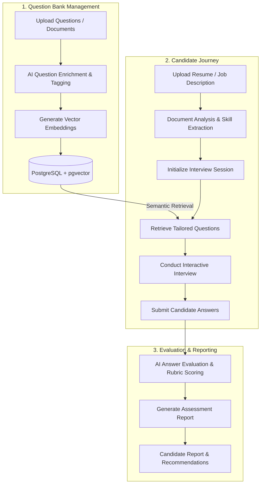

# Automated Interview Platform

Greenfield Angular/Spring Boot application for the automated interview MVP.

## High-Level Application Flow

The Automated Interview Platform automates the end-to-end technical interview lifecycle—from question curation and resume analysis to live interactive interviewing and AI-driven candidate evaluation.



### Flow Breakdown

1. **Question Bank Curation & AI Enrichment (`/question-bank`)**:
   - **Ingestion**: Administrators upload questions or bulk documents.
   - **Enrichment**: Vertex AI / Spring AI parses, categorizes (topics, difficulty, competencies), and generates assessment rubrics.
   - **Vector Indexing**: Questions are embedded and stored in PostgreSQL using `pgvector` for semantic similarity search.

2. **Candidate Document Analysis & Session Setup (`/` & `/sessions/:id/analysis`)**:
   - **Resume & Job Description Parsing**: The candidate provides their resume/details.
   - **Skill Extraction**: Document analysis identifies key competencies, experience level, and domain expertise.
   - **Adaptive Question Retrieval**: `pgvector` retrieves the most relevant and calibrated interview questions tailored to the candidate's profile.

3. **Interactive Interview Execution (`/sessions/:id/interview`)**:
   - **Live Interview Flow**: The candidate progresses through tailored technical and behavioral questions sequentially.
   - **Response Submission**: Candidate answers are captured and saved with session state tracking.

4. **AI-Powered Evaluation & Reporting (`/sessions/:id/report`)**:
   - **Rubric Scoring**: Responses are evaluated by AI against standardized grading criteria, scoring accuracy, depth, clarity, and relevance.
   - **Comprehensive Report**: Generates an actionable assessment report with overall scoring, category breakdowns, strengths, areas for improvement, and hiring recommendations.

---

## Local foundation

1. Copy `.env.example` to `.env`. The example file is already wired to `VERTEX_PROJECT_ID=intervu-ai-20260704-8f3c`; keep that value or replace it with your own Vertex project. Run `gcloud auth application-default login` once; Compose mounts the local ADC file into the backend and refreshes access tokens automatically. Never commit `.env` or Google credential files.
2. Start PostgreSQL/pgvector and the backend:

```powershell
docker compose up --build
```

3. Start the Angular development server:

```powershell
cd frontend
npm ci
npm start -- --host 127.0.0.1 --port 4200
```

The database is available only on `127.0.0.1:5432`; the backend is internal to
Compose and the frontend is available on `127.0.0.1:4200`.

Health check: `http://127.0.0.1:4200/api/health`

Candidate routes are `/`, `/sessions/:id/analysis`,
`/sessions/:id/interview`, and `/sessions/:id/report`. The owner question-bank
route is `/question-bank`.

The `.env.example` profiles are set to the Vertex target runtime. For
provider-free development, set `APP_ANSWER_EVALUATION_PROFILE` and
`APP_EMBEDDING_PROFILE` to `local` (question import remains AI-backed because
its structured enrichment is provider-required). Provider failures fail closed with
stable API problem codes and never create partial sessions or evaluations.

If `VERTEX_PROJECT_ID` is missing while an `ai` profile is enabled, backend
startup now fails fast with a targeted validation error before Spring AI can
emit a lower-level autoconfiguration exception.

Spring AI is enabled for the migrated Google GenAI/Vertex adapters with
`SPRING_AI_MODEL_CHAT=google-genai` and `SPRING_AI_MODEL_EMBEDDING_TEXT=google-genai` are enabled by default. Use the three `ai` profiles and
`AI_DATA_RETENTION_ACKNOWLEDGED=true` for live validation.
For a provider-outage drill with no ADC mounted, set
`APP_SPRING_AI_CREDENTIALS_AVAILABLE=false`; the application will boot and
return its stable provider-unavailable API problem instead of failing startup.

For local Vertex setup:

```powershell
gcloud auth application-default login
gcloud auth application-default set-quota-project intervu-ai-20260704-8f3c
gcloud services enable aiplatform.googleapis.com --project intervu-ai-20260704-8f3c
```

Spring AI uses Application Default Credentials for Vertex mode, avoiding
short-lived token configuration in `.env`.

Verification commands:

```powershell
npm test --prefix contracts
npm run build --prefix frontend
mvn test -q -f backend/pom.xml
docker compose ps
```

The backend test suite includes a Docker-backed pgvector smoke test. Playwright
validation covers the candidate and owner pages at desktop and 360px viewports;
the browser scripts used for local validation are kept outside the application
bundle and do not access provider credentials.

The repository is being implemented in the PRD milestone order: contracts,
runtime foundation, document analysis, retrieval, question import, interview
evaluation, Angular journeys, and final verification.

Production does not seed demo questions. Import owner questions through the
question-bank flow. Set `APP_QUESTION_BANK_SEED_ENABLED=true` only for local
demo environments; keep it `false` in production.
