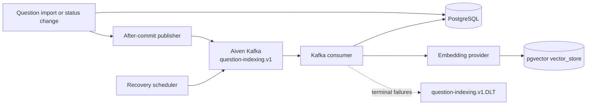

# Question Indexing: Before and After

## Before

Question changes were stored in PostgreSQL and a scheduled `QuestionIndexingWorker` periodically claimed pending rows. The worker called the embedding provider directly and wrote the Spring AI `vector_store` projection.

## After

Question mutations still use PostgreSQL as the source of truth, but publish an `UPSERT` or `DELETE` event after the transaction commits. A single Aiven Kafka topic transports the event to `QuestionIndexingConsumer`, which performs the embedding or deletion and then updates the existing indexing state columns.

The recovery scheduler republishes pending, expired, or inconsistent rows. This closes the small crash window between a successful database commit and Kafka publication without adding an outbox table.

## Runtime configuration

Production enables Kafka with `APP_KAFKA_INDEXING_ENABLED=true` and supplies the Aiven bootstrap server, SASL username/password, and CA certificate through Google Secret Manager. Local Compose does not run Kafka; set the flag to `true` only when Aiven credentials are available.

The frontend exposes the PostgreSQL indexing status (`PENDING`, `PROCESSING`, `INDEXED`, or `FAILED`) and refreshes the list once after an import or status change. It does not connect to Kafka.
